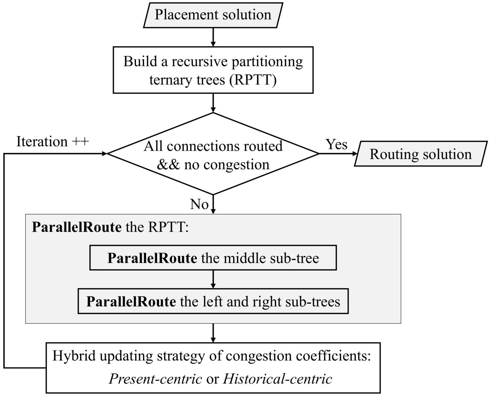

# Parallel Routing for Commercial FPGAs

## Introductions
This repository provides a fast parallel routing approach for commercial FPGAs. It is developed based on the RWRoute in [RapidWright](https://www.rapidwright.io/) and won the second place ([CUFR](https://xilinx.github.io/fpga24_routing_contest/results.html)) in the [Runtime-First FPGA Interchange Routing Contest @ FPGA'24](https://xilinx.github.io/fpga24_routing_contest/index.html). 

As depicted in the following figure, given the placement solution, it first builds a recursive partitioning ternary tree (RPTT) to facilitate the scheduling of multi-net parallel routing. Subsequently, it iteratively performs parallel routing based on the RPTT and updates the congestion coefficients until a valid and resource overflow-free routing solution is found. Additionally, it employs a hybrid updating strategy (HUS), containing present-centric and historical-centric updating, for congestion coefficients at the end of each routing iteration to expedite congestion resolution.



More details are in the following paper:

Xinshi Zang, Wenhao Lin, Shiju Lin, Jinwei Liu and Evangeline F.Y. Young. [An Open-Source Fast Parallel Routing Approach for Commercial FPGAs](doc/glsvlsi24-camera-ready.pdf). In Proceedings of the Great Lakes Symposium on VLSI 2024. (To appear)

## Requirements
The requirements follow those of the official [repository](https://github.com/Xilinx/fpga24_routing_contest) of the FPGA'24 routing contest.

## How to run
```
cd parallel-routing
make
```
The 'make' will automatically download the benchmarks, build and run the codes.

## Results
The reference results of the parallel routing approach on the FPGA24 contest public [benchmarks](https://xilinx.github.io/fpga24_routing_contest/benchmarks.html) are as follows. Experiments are conducted on a hpc server equipped with a 2.90GHz CPU and 768GB memory.
|     Benchmark          | Runtime | Wirelength |  Score |
|------------------------|--------:|-----------:|-------:|
| logicnets_jscl         |   35.26 |        234 |  55.13 |
| boom_med_pb            |   144.5 |        806 | 210.65 |
| vtr_mcml               |   94.29 |        584 | 143.26 |
| rosetta_fd             |  125.32 |        804 | 193.19 |
| corundum_25g           |  131.11 |        500 |    168 |
| finn_radioml           |   63.29 |        251 |  82.06 |
| vtr_lu64peeng          |  114.12 |       1333 | 236.01 |
| corescore_500          |   73.03 |        668 | 132.52 |
| corescore_500_pb       |  138.63 |        739 | 198.67 |
| mlcad_d181_lefttwo3rds |  409.81 |        771 | 445.93 |
| koios_dla_like_large   |  181.47 |        520 | 215.33 |
| boom_soc               |  635.33 |       1673 |  739.1 |
| ispd16_example2        |  314.65 |        939 | 377.09 |

## Citation
If you find our method useful in your research, please consider to cite:
```bibtex
@inproceedings{zang2024parallel,
  title={An Open-Source Fast Parallel Routing Approach for Commercial FPGAs},
  author={Zang, Xinshi and Lin, Wenhao and Lin, Shiju and Liu, Jinwei and Young, Evangeline FY},
  booktitle={Proceedings of the Great Lakes Symposium on VLSI 2024},
  year={2024}
}
```

## Contact
- Xinshi Zang (xszang@cse.cuhk.edu.hk)
- Wenhao Lin (whlin23@cse.cuhk.edu.hk)

## License
The license is identical to the RapidWright's [license](./LICENSE.TXT).